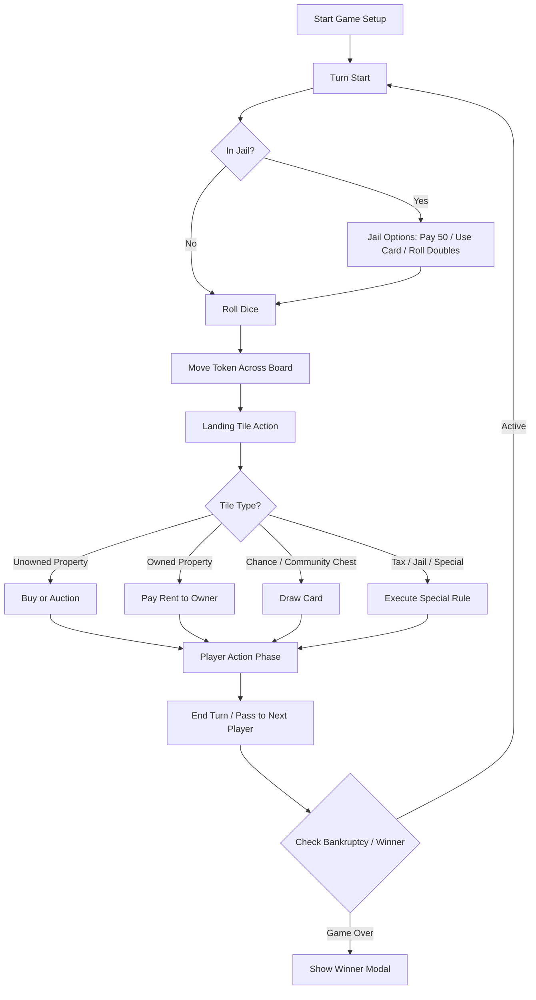

# Monopoly Local Multiplayer (Pass & Play) - Technical Architecture & MVP Roadmap

## 1. Technical Stack & Architecture

- **Framework**: Next.js (App Router, Client-side rendering enabled for game state and Web APIs).
- **Styling**: Tailwind CSS for responsive desktop and tablet layout.
- **State Management**: Zustand with persistent middleware (`localStorage`) to survive page refresh.
- **Animations**: Framer Motion for smooth token sliding across board tiles and dice roll animations.
- **Icons**: Lucide React.
- **Deployment**: Vercel (static export or serverless Next.js output).

---

## 2. Project File Structure

```text
e:/Playground/games/
├── public/
│   ├── audio/              # Sound effects (optional)
│   └── images/             # Token icons & card graphics
├── plans/
│   └── monopoly-architecture.md
├── src/
│   ├── app/
│   ├── layout.tsx
│   ├── page.tsx            # Main Menu & Setup (2-4 players, token selection)
│   └── game/
│       └── page.tsx        # Active Game Board View
├── components/
│   ├── board/
│   │   ├── Board.tsx       # 40-space board layout (CSS Grid)
│   │   ├── Tile.tsx        # Individual space renderer
│   │   └── Token.tsx       # Player token renderer
│   ├── controls/
│   │   ├── PlayerHUD.tsx   # Current player stats & cash
│   │   ├── DiceBox.tsx     # Dice roll component + animation
│   │   └── ActionPanel.tsx # Buy, End Turn, Build houses, Mortgage
│   └── modals/
│       ├── TradeModal.tsx  # Property and cash trading between players
│       ├── AuctionModal.tsx# Property auction interface
│       ├── CardModal.tsx   # Chance / Community Chest card display
│       └── GameOverModal.tsx # Winner detection & stats
├── store/
│   └── gameStore.ts        # Zustand store + persistence
└── engine/
    ├── boardData.ts        # 40 spaces definition (name, cost, rent, color group)
    ├── cardsData.ts        # 16 Chance + 16 Community Chest cards
    └── gameLogic.ts        # Rules for movement, rent calculation, jail, bankruptcy
```

---

## 3. Game State Machine & Flow



---

## 4. Responsive Design Strategy (Desktop & Tablet Touch)

- **Desktop Layout**: Side-by-side view where the Monopoly board occupies the center/left (square aspect ratio), and the right side hosts the Player HUD, Dice rolling area, Action Panel, and Property Portfolio.
- **Tablet (Touch-friendly) Layout**: Stacked or drawer-based layout optimized for portrait/landscape iPad use. Large touch targets (minimum 48px), swipeable drawers for property management and trading, and clear Pass & Play transition overlays between turns.

---

## 5. MVP & Development Milestones

> **Development Status (verified against the codebase on 2026-08-15):**
>
> | Phase | Status | Notes |
> |-------|--------|-------|
> | Phase 1: Core Foundation & Board UI | ✅ Complete | See [`phase-1-foundation.md`](phase-1-foundation.md) |
> | Phase 2: Property System & Economy | ✅ Complete | See [`phase-2-implementation.md`](phase-2-implementation.md) |
> | Phase 3: Cards, Jail & Special Spaces | ✅ Complete | Minor deviations documented in [`phase-3-implementation.md`](phase-3-implementation.md) |
> | Phase 4: Advanced Features & Persistence | ✅ Complete | Trading + auction systems implemented (see [`phase-4-implementation.md`](phase-4-implementation.md)). Bankruptcy / asset liquidation / winner detection / `localStorage` were completed earlier. `GameOverModal` remains inlined in the game page (optional refactor). |
> | Phase 5: Polish, Animations & Vercel | ✅ Complete | Token/dice animations + synthesized sounds + **Pass & Play turn-handoff overlay** (`src/components/controls/PassAndPlayScreen.tsx`, hides the board between turns) + **`vercel.json` deployment config**. Unused `lucide-react` dependency removed. |

### Phase 1: Core Foundation & Board UI
- Initialize Next.js project with Tailwind CSS and Zustand.
- Implement the 40-space standard US Monopoly board layout with CSS grid.
- Player setup screen (2-4 players, name input, token selection).
- Basic dice roll and linear token movement around the board.

### Phase 2: Property System & Economy
- Property ownership data structures (titles, color groups, mortgage status).
- Buy property dialogs and automatic rent deduction when landing on owned properties.
- House and hotel building mechanics and rent scaling.
- Mortgage and unmortgage actions.

### Phase 3: Cards, Jail & Special Spaces
- Implement all 16 Chance and 16 Community Chest cards with shuffle and draw logic.
- Jail mechanics (3 turns limit, paying bail, rolling doubles, Get Out of Jail Free card).
- Tax spaces (Income Tax, Luxury Tax) and Free Parking / Go / Visiting Jail handling.

### Phase 4: Advanced Features & Persistence
- Property trading system between players (cash + properties).
- Property auction system when a player declines to buy.
- Bankruptcy detection, asset liquidation, and winner detection.
- `localStorage` persistence middleware so refreshing the page preserves the exact game state.

### Phase 5: Polish, Animations & Vercel Deployment
- Framer motion smooth token traversal and dice rolling visual feedback.
- Pass & Play turn transition screen (hiding cash/properties during handoff on iPad).
- Vercel build verification and deployment configuration.
